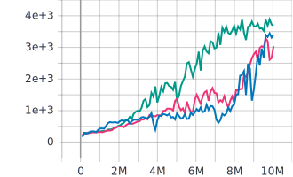

# Tuned A2C

## Training Hyperparameters
| Hyperparameter                | Value |
| ----------------------------- | ----- |
| Actors                        | 256   |
| Rollout Length                | 20    |
| Discount Factor (Gamma)       | 0.99  |
| Value Function Loss Weight    | 0.5   |
| Entropy Regularization Weight | 0.01  |
| Gradient Norm Clipping        | 0.5   |
| Learning Rate                 | 1e-3  |
| RMSprop Alpha                 | 0.99  |
| RMSprop Momentum              | 0.0   |
| RMSprop Epsilon               | 1e-8  |

## A2C
A2C using the original model architecture as described in [Asynchronous Methods for Deep Reinforcement Learning](https://arxiv.org/abs/1602.01783)

### Average Score @10M Samples
| Environment | Tuned A2C | A3C (16 Actors) |
| ----------- | --------- | --------------- |
| Breakout    | 334       | ~150            |
| Q*bert      | 3406      | ~1000           |

### Breakout

### Q*bert

## A2C Small
A2C using a modified model architecture tuned for smaller input (42x42) as described in [Learning Atari: An Exploration of the A3C Reinforcement Learning Method](https://bcourses.berkeley.edu/files/70573736/download?download_frd=1.)

Achieves similar performance with a **1.84x** speedup.

Learning rate is optionally annealed linearly from 1e-3 to 1e-4 at end at 10M samples

### Average Score @10M Samples
| Environment | Tuned A2C Small | Tuned A2C | A3C (16 Actors) |
| ----------- | --------------- | --------- | --------------- |
| Breakout    | 360             | 334       | ~150            |
| Q*bert      | 3041            | 3406      | ~1000           |

### Breakout

- Orange - Tuned A2C
- Red - Tuned A2C Small
- Blue - Tuned A2C Small (Learning Rate Annealed)

### Q*bert

- Blue - Tuned A2C
- Pink - Tuned A2C Small
- Green - Tuned A2C Small (Learning Rate Annealed)
